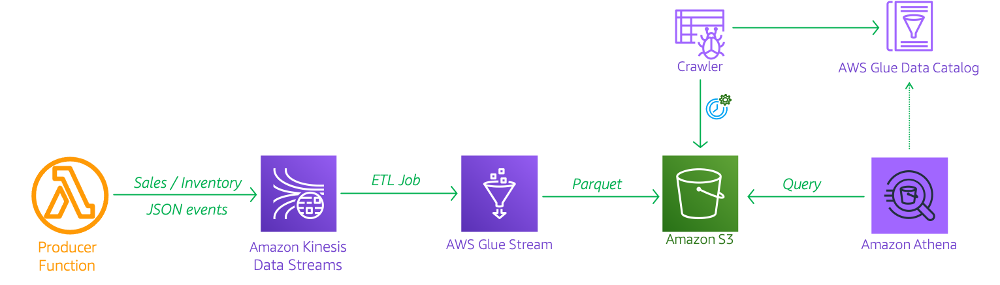
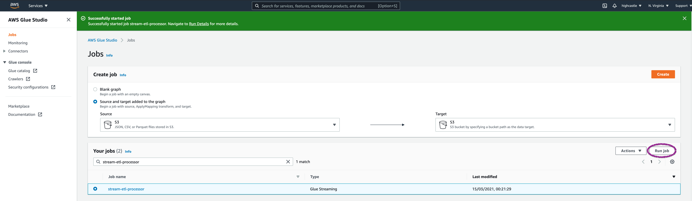
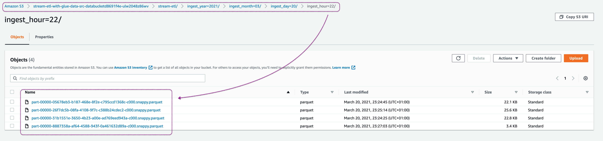
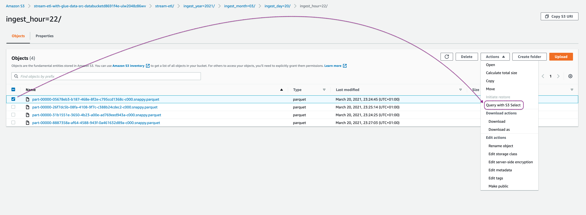
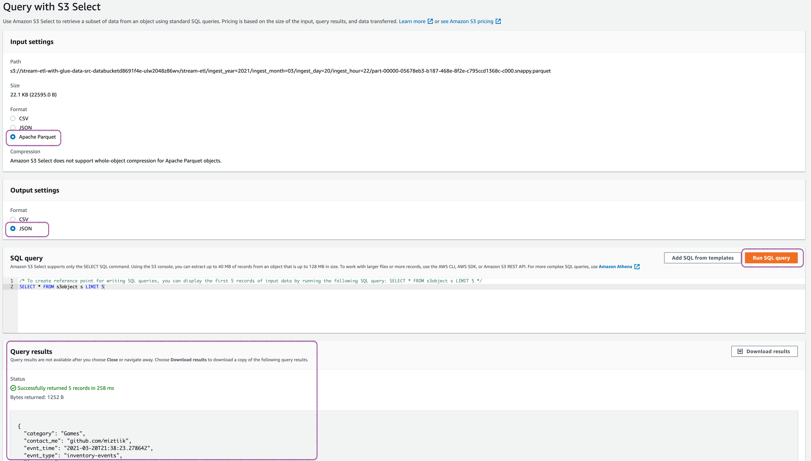
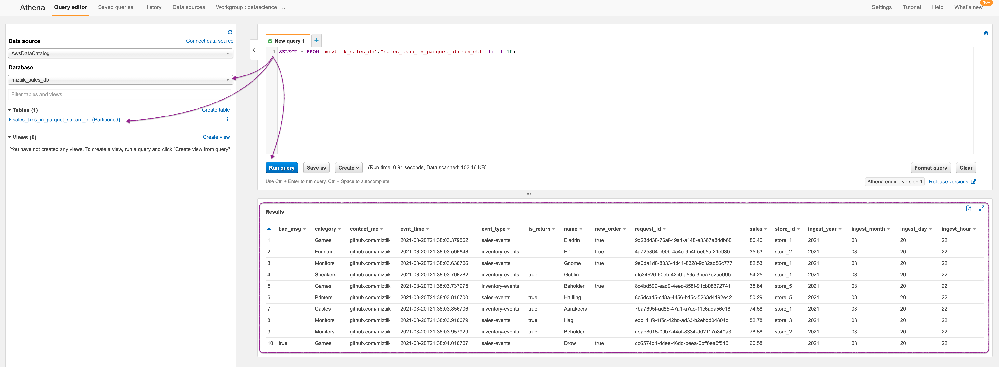
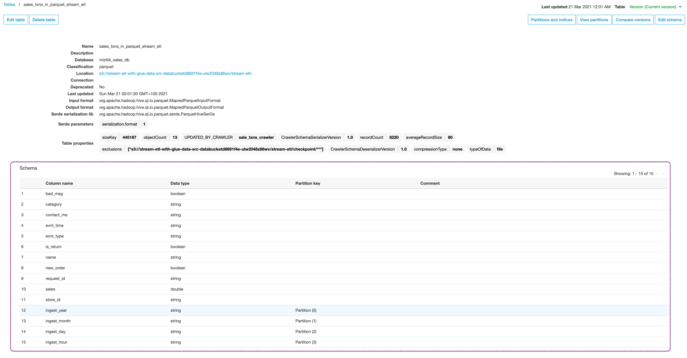

# Streaming ETL with AWS Glue

The developers at Mystique Unicorn are exploring building their data lake in AWS. They have a streaming use case where new data is continuously ingested into a data lake. This creates many small files that may impact query performance. A common challenge the developers face is working with data files that don’t have proper name header records. They’re tasked with renaming the columns of the data files appropriately so that downstream application and mappings for data load can work seamless.

Can you help them to process incoming events and process the incoming events from `JSON` format to `parquet` and store them in S3 to allow them to query with Athena.

## 🎯 Solutions

AWS Glue is a fully managed serverless data integration service that makes it easy to extract, transform, and load (ETL) from various data sources for analytics and data processing with Apache Spark ETL jobs. In this application, we will receive the incoming events from generated by lambda function and process them using Glue Jobs to convert to parquet and store in S3. Let us assume each store produces an event like the one shown below,

```json
{
  "request_id": "3eb786b9-6ace-47c5-9c86-9c2907156632",
  "name": "Deep Gnome",
  "category": "Laptops",
  "store_id": "store_4",
  "evnt_time": "2021-03-20T21:39:02.478671",
  "evnt_type": "inventory-events",
  "sales": 73.93,
  "contact_me": "github.com/miztiik",
  "is_return": true
}
```





1.  ## 🧰 Prerequisites

    This demo, instructions, scripts and cloudformation template is designed to be run in `us-east-1`. With few modifications you can try it out in other regions as well(_Not covered here_).

    - 🛠 AWS CLI Installed & Configured - [Get help here](https://youtu.be/TPyyfmQte0U)
    - 🛠 AWS CDK Installed & Configured - [Get help here](https://www.youtube.com/watch?v=MKwxpszw0Rc)
    - 🛠 Python Packages, _Change the below commands to suit your OS, the following is written for amzn linux 2_
      - Python3 - `yum install -y python3`
      - Python Pip - `yum install -y python-pip`
      - Virtualenv - `pip3 install virtualenv`

1.  ## ⚙️ Setting up the environment

    - Get the application code

      ```bash
      git clone https://github.com/miztiik/stream-etl-with-glue
      cd stream-etl-with-glue
      ```

1.  ## 🚀 Prepare the dev environment to run AWS CDK

    We will use `cdk` to make our deployments easier. Lets go ahead and install the necessary components.

    ```bash
    # You should have npm pre-installed
    # If you DONT have cdk installed
    npm install -g aws-cdk

    # Make sure you in root directory
    python3 -m venv .venv
    source .venv/bin/activate
    pip3 install -r requirements.txt
    ```

    The very first time you deploy an AWS CDK app into an environment _(account/region)_, you’ll need to install a `bootstrap stack`, Otherwise just go ahead and deploy using `cdk deploy`.

    ```bash
    cdk bootstrap
    cdk ls
    # Follow on screen prompts
    ```

    You should see an output of the available stacks,

    ```bash
    stream-etl-with-glue-producer-stack
    stream-etl-with-glue-txns-tbl-stack
    stream-etl-with-glue-data-src-bkt-stack
    stream-etl-with-glue-job-stack
    stream-etl-with-glue-crawler-stack

    ```

1.  ## 🚀 Deploying the application

    Let us walk through each of the stacks,

    - **Stack: stream-etl-with-glue-producer-stack**

      This stack will create a kinesis data stream and the producer lambda function. Each lambda runs for a minute ingesting stream of sales events for `5` different stores ranging from `store_id=1` to `store_id=5`. We also randomly make some events as `return` orders

      Initiate the deployment with the following command,

      ```bash
      cdk deploy stream-etl-with-glue-producer-stack
      ```

      After successfully deploying the stack, Check the `Outputs` section of the stack. You will find the `StoreOrdersEventsProducer` producer lambda function. We will invoke this function later during our testing phase.

    - **Stack: stream-etl-with-glue-txns-tbl-stack**

      This stack will create the Glue Database: `miztiik_sales_db` & Catalog Table: `sales_txns_tbl` that hold the metadata about the store events data. This will allow us to query the events later using Athena. We will hook up the table source to be our kinesis data stream created in the previous stack.

      Initiate the deployment with the following command,

      ```bash
      cdk deploy stream-etl-with-glue-txns-tbl-stack
      ```

      After successfully deploying the stack, Check the `Outputs` section of the stack. You will find the `GlueTxnsTable` resource.

    - **Stack: stream-etl-with-glue-data-src-bkt-stack**

      This stack will create a S3 bucket that will be used by Glue to persist the incoming events after transforming them into parquet format.

      ```bash
      cdk deploy stream-etl-with-glue-data-src-bkt-stack
      ```

      After successfully deploying the stack, Check the `Outputs` section of the stack. You will find the `dataSourceBucket` resource.

    - **Stack: stream-etl-with-glue-job-stack**

      This stack will create a Glue Job. For glue jobs you need to supply a script that transform the incoming the `JSON` events to `parquet` events. I have used the Glue console earlier to generate the code the for me. The code is provided to you in this location `stacks/back_end/glue_stacks/glue_job_scripts/kinesis_streams_batch_to_s3_etl.py`. I have parameterized the script so that we can pass in the database, table and bucket name as glue job parameters. The S3 prefix has been set to `stream-etl`. When we check the S3 bucket later for parquet files, we will look under this location.
        - `src_db_name`
        - `src_tbl_name`
        - `datalake_bkt_name`
        - `datalake_bkt_prefix`

      As this will be stream processing, the Glue job `timeout` is not set, so that the job runs continuously and as the incoming events size is small, we will set up job to consume `1 DPU`. As a learning attempt on how to setup job triggers, I have also set up the job to be triggered to every day at 1 in the morning.

      Glue jobs for streaming events does not use `bookmarks` rather uses `checkpoint` to keep track of incoming data. You should be able to find them in your S3 bucket. As this is metadata about the incoming event stream, we will later use this location to be excluded from our queries. 

      ```bash
      cdk deploy stream-etl-with-glue-job-stack
      ```

      After successfully deploying the stack, Check the `Outputs` section of the stack. You will find the `StreamingETLGlueJob` Glue Job.


    - **Stack: stream-etl-with-glue-crawler-stackk**

      To allows to query the data that is stored in our S3, we need to identify the partitions and schema of our incoming events. We will use Glue Crawler to accomplish the same. We will set up a Glue Crawler on run every hour and also add an exclusion for `checkpoint/**` data.

      The crawled data is added under a new table with the prefix `sales_txns_in_parquet_` under our glue database that we created within our `stream-etl-with-glue-txns-tbl-stack`

      ```bash
      cdk deploy stream-etl-with-glue-crawler-stack
      ```

      After successfully deploying the stack, Check the `Outputs` section of the stack. You will find the `SaleTransactionsCrawler` resource.


1.  ## 🔬 Testing the solution

    1. **Invoke Producer Lambda**:
      Let us start by invoking the lambda `StoreOrdersEventsProducer` from the producer stack using the AWS Console. If you want to ingest more events, invoke the lambda few times.
          ```json
            {
              "status": true,
              "msg_cnt": 1184,
              "bad_msgs": 121,
              "sale_evnts": 581,
              "inventory_evnts": 603,
              "tot_sales": 57760.840000000004
            }
          ```
        Here in this invocation, We have ingested about `1184` messages. Within those message, we have `581` sale events and `121` is created as `bad_msgs` with a total sale value of `57760.84`

        At this point, we have events coming from our producers. Those events are processed by our job and stored in S3. This allows us to query them using Athena.

    1. **Invoke Glue Job**:

       After a couple of minutes, check the consumer cloudwatch logs. Usually the log name should be something like this, `/aws/lambda/events_consumer_fn`. Navigate to the log stream.

        


    1. **Check S3 Bucket**:

       Check the s3 bucket `dataSourceBucket` for the parquet files stored by Glue job

        

        You can observe that the events are stored as parquet in S3. Let us use S3 Select to quickly inspect the events,

        

        

    1. **Query with Amazon Athena**:

       Navigate to Athena service page, If this is the first time you are using Athena, You may have to setup a s3 location for query results to be stored. After that, make sure you select the datbase and table as shown in the image. Here we are running a simple select query against our table. You can observe that in this sample, one message wihtou `store_id` is flagged as `bad_msg` and events types are a mix of `new_order`  and `is_return`. You can also see the partitions as columns.

        

       If you check out Glue Table `sales_txns_in_parquet_stream_etl` schema (in Glue Service) you can find the schema we saw in Athena results,
        

1.  ## 📒 Conclusion

    Here we have demonstrated how to use Glue to process streaming events and transform them to parquet data and store them in S3 for further analysis using Athena. You can extend this further by visualizing the data using Quicksight or use machine learning to forecast sales or detect fraud.

1.  ## 🧹 CleanUp

    If you want to destroy all the resources created by the stack, Execute the below command to delete the stack, or _you can delete the stack from console as well_

    - Resources created during [Deploying The Application](#-deploying-the-application)
    - Delete CloudWatch Lambda LogGroups
    - _Any other custom resources, you have created for this demo_

    ```bash
    # Delete from cdk
    cdk destroy

    # Follow any on-screen prompts

    # Delete the CF Stack, If you used cloudformation to deploy the stack.
    aws cloudformation delete-stack \
      --stack-name "MiztiikAutomationStack" \
      --region "${AWS_REGION}"
    ```

    This is not an exhaustive list, please carry out other necessary steps as maybe applicable to your needs.

## 📌 Who is using this

This repository aims to show how to use AWS Glue for stream processing architecture to new developers, Solution Architects & Ops Engineers in AWS. Based on that knowledge these Udemy [course #1][102], [course #2][101] helps you build complete architecture in AWS.

### 💡 Help/Suggestions or 🐛 Bugs

Thank you for your interest in contributing to our project. Whether it is a bug report, new feature, correction, or additional documentation or solutions, we greatly value feedback and contributions from our community. [Start here](/issues)

### 👋 Buy me a coffee

[](https://ko-fi.com/Q5Q41QDGK) Buy me a [coffee ☕][900].

### 📚 References

1. [Docs: Streaming ETL Notes and Restrictions][1]


### 🏷️ Metadata


**Level**: 200

[1]: https://docs.aws.amazon.com/glue/latest/dg/add-job-streaming.html#create-job-streaming-restrictions

[100]: https://www.udemy.com/course/aws-cloud-security/?referralCode=B7F1B6C78B45ADAF77A9
[101]: https://www.udemy.com/course/aws-cloud-security-proactive-way/?referralCode=71DC542AD4481309A441
[102]: https://www.udemy.com/course/aws-cloud-development-kit-from-beginner-to-professional/?referralCode=E15D7FB64E417C547579
[103]: https://www.udemy.com/course/aws-cloudformation-basics?referralCode=93AD3B1530BC871093D6
[899]: https://www.udemy.com/user/n-kumar/
[900]: https://ko-fi.com/miztiik
[901]: https://ko-fi.com/Q5Q41QDGK
